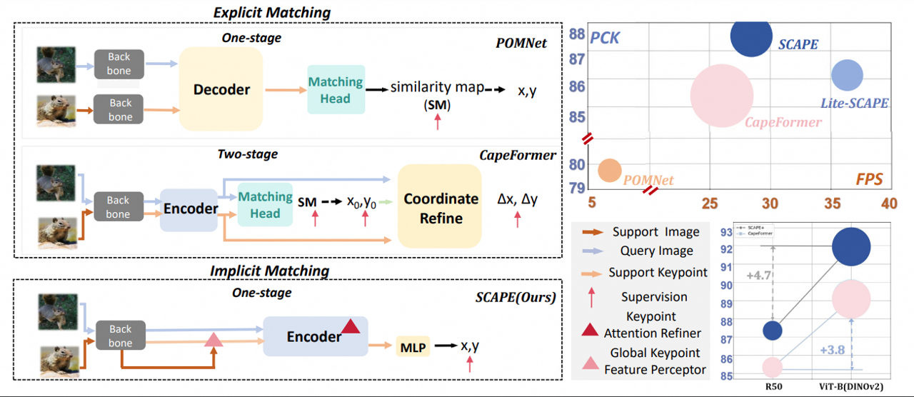

<h1 align="center">SCAPE [ECCV 2024]</h1>

Official code repository for the paper:  
[**SCAPE: A Simple and Strong Category-Agnostic Pose Estimator**]  


<p align="center"></p>


## TODO:
- [ ] Release code for train and inference
- [ ] Release pre-trained models

## Usage

### Install
We train and evaluate our model on Python 3.7 and Pytorch 1.10.2 with CUDA 11.1. Other versions can probably work. Please first install pytorch and torchvision following official documentation [Pytorch](https://pytorch.org/get-started/previous-versions/). Then, prepare the following packages:
```
mmcv-full=1.3.17
mmpose=1.3.17
```
Having installed these packages, run `python setup.py develop`.

### Data preparation
Please follow the [official guide](https://github.com/luminxu/Pose-for-Everything) to prepare the MP-100 dataset for training and evaluation, and organize the data structure properly. 

### Training
Training CAPEFormer on 1-shot setting only need one GPU (8GB memory is enough) and 5-shot setting only need one GPU(>12GB). To train the model, first specify the data path and output directory in the configuration file. Here we show an example of training CAPEFormer on MP-100 dataset split1. 


#### Train with a single GPU
```shell
python train.py --config ${CONFIG_FILE} --work-dir ${SAVE_PATH} [optional arguments]
```

#### Train with multiple GPUs with pytorch distributed backend
Please follow the [official guide](https://github.com/luminxu/Pose-for-Everything)
```shell
./tools/dist_train.sh ${CONFIG_FILE} ${GPU_NUM} ${SAVE_PATH}
```

### Test


#### Test with a single GPU
The evaluation on a single GPU will cost approximatly 40min. After organizing the data and the pre-trained checkpoints, you can run the following commands for testing:
```shell
python test.py ${CONFIG_FILE} ${CHECKPOINT_FILE} [optional arguments]
```

## Citation


## Acknowledgement

Thanks to:

- [MMPose](https://github.com/open-mmlab/mmpose)
- [Pose-for-Everything](https://github.com/luminxu/Pose-for-Everything)
- [CapeFormer](https://github.com/luminxu/Pose-for-Everything)

## License

This project is released under the [Apache 2.0 license](LICENSE).
